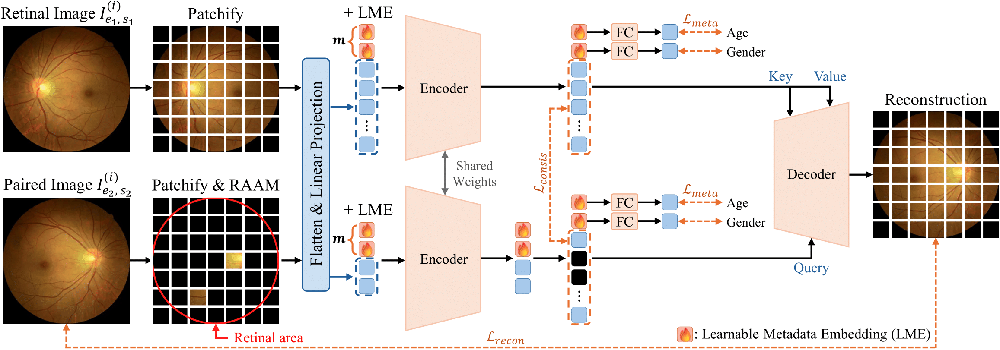

<p align="center">
  <h1 align="center">PRETI: Patient-Aware Retinal Foundation Model via Metadata-Guided Representation Learning</h1>
  <h3 align="center"><b>MICCAI 2025 (Early Accept)</b></h3>
  <p align="center">
    <h4 align="center">
      <strong>Yeonkyung Lee</strong></a> · 
      <strong>Woojung Han</strong></a> · 
      <strong>Youngjun Jun</strong></a> · 
      <strong>Hyeonmin Kim</strong></a> · 
      <strong>Jungkyung Cho</strong></a> · 
      <strong>Seong Jae Hwang</strong></a>
    </h4>
    <h4 align="center">
      Yonsei University ·
      Mediwhale
    </h4>
  </p>
  <p align="center">
    <a href="https://arxiv.org/abs/2505.12233"></a>
  </p>
  <br>
</p>

# Abstract
Retinal foundation models have significantly advanced retinal image analysis by leveraging self-supervised learning to reduce dependence on labeled data while achieving strong generalization. Many recent approaches enhance retinal image understanding using report supervision, but obtaining clinical reports is often costly and challenging. In contrast, metadata (e.g., age, gender) is widely available and serves as a valuable resource for analyzing disease progression. To effectively incorporate patient-specific information, we propose PRETI, a retinal foundation model that integrates metadata-aware learning with robust self-supervised representation learning. We introduce Learnable Metadata Embedding (LME), which dynamically refines metadata representations. Additionally, we construct patient-level data pairs, associating images from the same individual to improve robustness against non-clinical variations. To further optimize retinal image representation, we propose Retina-Aware Adaptive Masking (RAAM), a strategy that selectively applies masking within the retinal region and dynamically adjusts the masking ratio during training. PRETI captures both global structures and fine-grained pathological details, resulting in superior diagnostic performance. Extensive experiments demonstrate that PRETI achieves state-of-the-art results across diverse diseases and biomarker predictions using in-house and public data, indicating the importance of metadata-guided foundation models in retinal disease analysis.

<p align="center">
  

<br>

# Install Environment

Our code is based on the requirements of the official [CropMAE repository](https://github.com/alexandre-eymael/CropMAE).  
In addition to those requirements, we include several additional dependencies, which can be found in `requirements.txt`.  
To set up the environment, please run:


```
conda create -n preti python=3.11
conda activate preti
pip install -r requirements.txt
```
<br>

# Dataset Structure
Our model uses a paired fundus image dataset with age, gender, and corresponding ROI masks. Each sample consists of a left-right eye pair (can include self-pairs) and their corresponding metadata.

### 🔧 Requirements
To build the dataset correctly, you need:

1. A CSV file with the following columns:
- `patient_id`: Unique ID per subject
- `exam_id`: Examination ID
- `jpg_h512_path_automorph`: Path to the fundus image (resolution 512x512 recommended)
- `mask_path`: Path to the binary mask image
- `age`: Age of the patient (float or int)
- `gender`: "Male" or "Female"
- `laterality`: Value indicating eye side (e.g., 0.0 = Left, 1.0 = Right)

2. Images & masks must be accessible via paths in the CSV.

<br>

# Model Variants

| Script Name                   | Description                                                                 |
|------------------------------|-----------------------------------------------------------------------------|
| `run_train.py`               | Full **PRETI** model with both **LME** (Learnable Metadata Embedding) and **RAAM** (Region-Aware Attention Masking). |
| `run_train_no_meta.py`       | PRETI **without LME** – removes metadata embeddings for age and gender.     |
| `run_train_no_ram.py`        | PRETI **without RAAM** – disables region-aware masking, using random masking instead. |
| `run_train_no_meta_no_ram.py`| PRETI **without both LME and RAAM** – baseline model with no metadata or region-aware masking. |


<br>

# Pretrained Weights

We provide pretrained weights for the PRETI model trained on fundus image pairs.


| Model Variant | Description               | Download Link |
|---------------|---------------------------|----------------|
| `preti-vitb`  | ViT-Base backbone, 119 epochs | [Download](https://drive.google.com/file/d/1mEFm3bxSPPOm4bLPC9Ey64oeq-6F0S0G/view?usp=drive_link) |

<br>

## Citation
If you found this code useful, please cite the following paper:

```
@InProceedings{2025preti,
    author    = {Lee, Yeonkyung and Han, Woojung and Jun, Youngjun and Kim, Hyeonmin and Cho, Jungkyung and Hwang, Seong Jae},
    title     = {PRETI: Patient-Aware Retinal Foundation Model via Metadata-Guided Representation Learning},
    booktitle = {International Conference on Medical Image Computing and Computer-Assisted Intervention},
    year      = {2025},
    organization={Springer}
}
```
